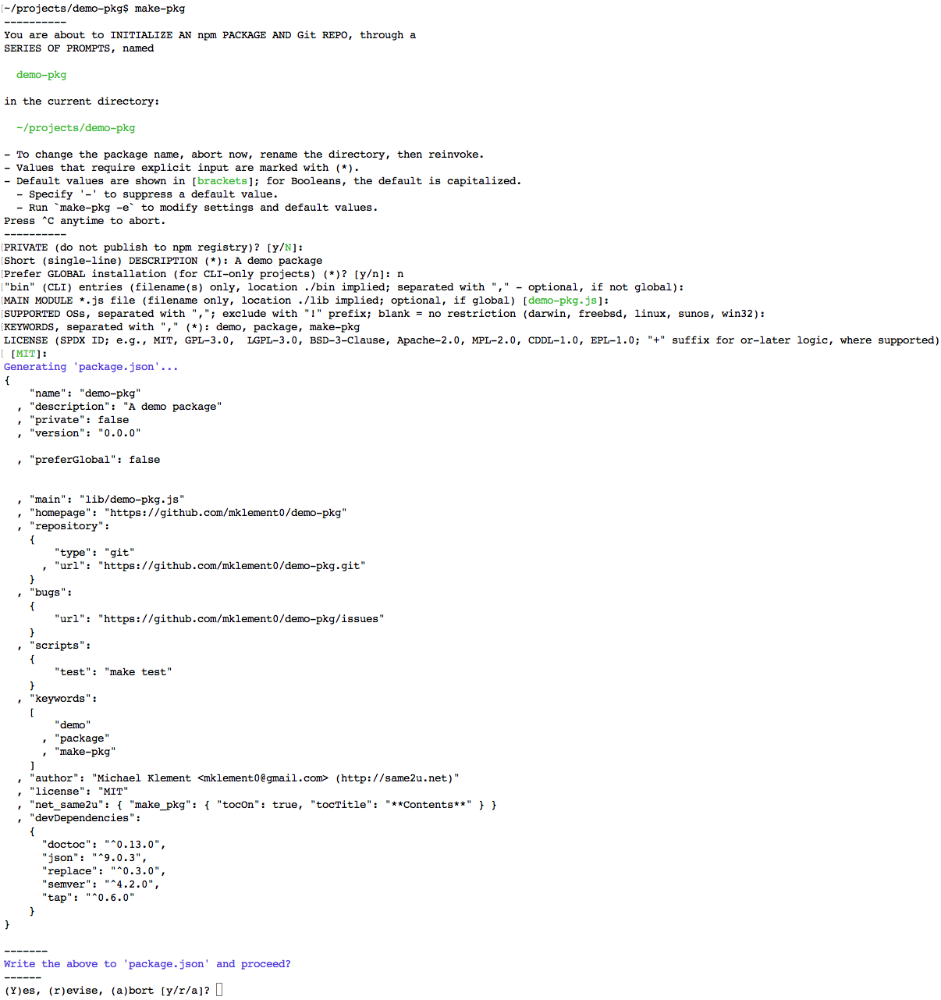

[](http://badge.fury.io/js/make-pkg)

<!-- START doctoc generated TOC please keep comment here to allow auto update -->
<!-- DON'T EDIT THIS SECTION, INSTEAD RE-RUN doctoc TO UPDATE -->

**Contents**

- [make-pkg &mdash; Introduction](#make-pkg-&mdash-introduction)
- [Package initialization (scaffolding)](#package-initialization-scaffolding)
- [Package release and maintenance](#package-release-and-maintenance)
- [Supported platforms](#supported-platforms)
  - [Additional prerequisites](#additional-prerequisites)
- [Installation](#installation)
- [Usage](#usage)
  - [Example](#example)
  - [Initializing a new package](#initializing-a-new-package)
  - [Command-line syntax](#command-line-syntax)
- [License](#license)
  - [Acknowledgements](#acknowledgements)
  - [npm dependencies](#npm-dependencies)
- [Changelog](#changelog)

<!-- END doctoc generated TOC please keep comment here to allow auto update -->

# make-pkg &mdash; Introduction

`make-pkg` is a **Unix CLI for initializing [npm](https://www.npmjs.com/) package projects and implementing a release and maintenance workflow**.

The projects initialized are backed by a local [Git](http://git-scm.com/) repository with a remote [GitHub](https://github.com) counterpart.

While the **_typical_ use case is to create _npm_ packages**, `make-pkg` can be used to **manage GitHub-based OSS projects in general**.

`make-pkg` is **opinionated**, which allows it to **simplify and automate many tasks**.  
For instance, `make-pkg` is managed by itself, and this read-me was scaffolded by it and is also kept up-to-date by it on every release.

# Package initialization (scaffolding)

* **Initializes the `package.json` package-description file** through a series of prompts, with configurable defaults, similar to, but more fully-featured than `npm init`.
* Initializes **a local Git repository** and the `.gitignore` file.
* Creates a **corresponding remote repository on GitHub** and links the local repository to it.
* Instantiates **templates for various standard files**: `README.md`, `LICENSE.md`, `CHANGELOG.md`
* Creates **stubs** for the **main module file** and/or **CLIs**.
* Creates **stubs for tests**, plus a few standard tests for CLIs.
* For packages intended for publication in the npm registry, adds an **[npm version badge](http://badge.fury.io/)**.
* Installs **a `Makefile` that implements a set of tasks for releasing and ongoing package maintenance**, along with supporting development-dependency packages (which are the same ones as for this utility - see [npm Dependencies](#npm-dependencies))

# Package release and maintenance

Note that `make-pkg` itself is no longer in the picture after having initialized a package project; instead, **ongoing tasks are invoked through the standard `make` utility**.
These tasks are defined in file `Makefile`, which can be customized after the fact, if needed; **`make list` lists all top-level tasks**.

* **`make version`** and **`make verinfo`** update and list the **package's version number**, respectively:
    * `make verinfo` lists the current version number from `package.json` as well as the most recently assigned Git version tag; the Git tag is assumed to be in sync with the latest version published in the npm registry, if applicable; the `package.json` version may be ahead, in preparation for a new release.
    * `make version [VER=<new-ver>]` updates the package version number in `package.json` and, if present, in source files:
        * If `VER` is not specified, the new version number is _prompted_ for.
        * The new version number is validated, including to prevent accidental _lowering_ of the version number; however, in exceptional situations you may specify `FORCE=1` on the command line to override.
        * Updates the version number in `package.json`.
        * Updates the version number in source files in the `./bin` and `./lib` subfolders, using string replacement to update `v<major>.<minor>.<patch>` instances of the old version number.
        * `<new-ver>` can either be an explicit `<major>.<minor>.<patch>` version specifier or specify how to *increment* the current version number via the component to increment: `patch`, `minor`, `major`,
  `prepatch`, `preminor`, `premajor`, or `prerelease`.
* **`make update-readme`** updates file **`README.md` to act as a single source of all relevant, current project information**
    * Pulls in the then-current contents of the `LICENSE.md` and `CHANGELOG.md` files.
    * If needed, updates the calendar year in `LICENSE.md`.
    * If applicable, pulls in usage information output by the project's CLI.
    * By default, adds an auto-generated, auto-updating TOC (table of contents) at the top, courtesy of [doctoc](https://github.com/thlorenz/doctoc); see below for how to turn that off.
    * Lists the project's dependencies with links to their respective homepages.
* **`make toc`** turns inclusion of an **auto-generated, auto-updating TOC in `README.md`** on or off.
    * Shows the current TOC inclusion status and prompts to toggle it.
    * To change the TOC title, modify property `net_same2u.make_pkg.tocTitle` in file `package.json`.
    * To change the TOC settings for _future_ projects, run `make-pkg -e` and edit the `vTOC_*` settings.
    * To update the TOC on demand (generally not necessary), run `make update-toc`.
* **`make test`** runs **tests**:
    * Runs the tests defined in subdirectory `./test`; stubs are initially provided, as well as a couple of standard tests, if the project has a CLI.
    * If the project _only_ has a CLI, test library [urchin](https://www.npmjs.com/package/urchin) is used; otherwise, it is [tap](https://www.npmjs.com/package/tap).
* **`make release`** **integrates all of the above tasks** to **publish a release**; if any sub-task fails, the overall task is aborted:
    * Ensures that the active branch is `master` and that there are no untracked files.
    * If the `package.json` version number is already ahead of the latest Git version tag, that version number is offered as the new release's version number by default, but you can opt to change it. If you do, or if the package version number is not ahead, you're prompted for the new version number as described for `make version` above.
    * Runs the tests, as described above; `NOTEST=1` can be appended to the `make release` invocation to skip tests.
    * Adds a date-stamped section for the new version to `CHANGELOG.md` and opens it for editing to describe what's changed in the new release. 
    * Updates `README.md` as described above.
    * Commits, using the new changelog section as the commit message.
    * Creates an annotated Git version tag with the new version number; also (re)creates the lightweight 'stable' tag to mark the most recent stable version.
    * Pushes the changes and tags to the `master` branch of the remote `origin` GitHub repository.
    * Unless the project is marked as _private_ in `package.json`, publishes the new version to the [npm registry](https://www.npmjs.com/).
* **`make push`** **pushes changes** to the remote `origin` repository:
    * Initiates a commit, if necessary, but aborts if there are untracked files.
    * On successful commit, pushes changes, including tags, to the branch of the same name in the remote `origin` repository.
* **`make browse`** opens the project's **GitHub repository in the default browser**.
    * Note: Currently only supported on OS X and Debian-based Linux systems, such as Ubuntu.

# Supported platforms

**Linux and OS X**

In principle, any Unix-like platform with `bash` and GNU `make` and otherwise either GNU or BSD utilities.

## Additional prerequisites

* `npm` - as part of a [Node.js](https://nodejs.org/) or [io.js](https://iojs.org/) installation
* if publishing to the [npm registry](https://www.npmjs.com) is desired, an account there
* `git`, a [distributed version-control system](http://git-scm.com/)
* a [GitHub account](https://github.com/)

Note that `bash` is required both for running `make-pkg` initially and later for running the shell commands in `Makefile` via `make` from inside the projects generated.

# Installation

With [Node.js](http://nodejs.org/) or [io.js](https://iojs.org/) installed, install from the [npm registry](https://www.npmjs.com/package/make-pkg):

    [sudo] npm install make-pkg -g

**Note**:

* Whether you need `sudo` depends on how you installed Node.js / io.js and whether you've [changed permissions later](https://docs.npmjs.com/getting-started/fixing-npm-permissions); if you get an `EACCES` error, try again with `sudo`.
* The `-g` ensures [_global_ installation](https://docs.npmjs.com/getting-started/installing-npm-packages-globally) and is needed to put `make-pkg` in your system's `$PATH`.
With [Node.js](http://nodejs.org/) or [io.js](https://iojs.org/) installed, install from the [npm registry](https://www.npmjs.com/make-pkg):

# Usage

## Example

The following image shows an example interaction with the series of prompts presented during package initialization:



## Initializing a new package

* Create a directory for the new package project.
* `cd` to it.
* Run `make-pkg`
    * On first use you'll be prompted to specify required global settings and defaults, such as your GitHub username, your website, and your preferred OSS license.
        * To modify settings later, run `make-pkg -e` from any directory.
    * You'll be guided through a series of prompts to create the `package.json` file.
    * On confirming the intent to create the `package.json` file as presented, the remaining tasks - creating the repositories, instantiating templates, creating stubs - run automatically.

**To-dos after the project has been initialized**:

* Flesh out the stub module (in `./lib`) and/or CLI (in `./bin`) with the actual implementation.
* Flesh out the stub tests in `./test`.
* Flesh out `README.md`.
* Use the `make` tasks as described [above](#package-release-and-maintenance).

## Command-line syntax

<!-- DO NOT EDIT THE FENCED CODE BLOCK and RETAIN THIS COMMENT: The fenced code block below is updated by `make update-readme/release` with CLI usage information. -->

```
$ make-pkg --help

SYNOPSIS
  make-pkg [-l] [-f] 
  make-pkg -e

DESCRIPTION
  Initializes an npm package project in the current directory.

  To create a new package, change to a new or
  preexisting-but-empty directory and run make-pkg there.

  -l
    Local processing only: no attempt is made to create a matching
    repository on GitHub.

  -f
    Forces execution in the current directory, even if it is
    not empty. However, the only existing file that will be replaced 
    in that event is 'package.json' - other existing files, including
    a Git repository, if present, are left untouched.

  -e
    Opens this utility's settings file, $HOME/.make-pkg-rc, for editing.

  In addition to initializing 'package.json', this utility:
   * initializes a local Git repository, adds a .gitignore file, defines the
     remote 'origin' repo
   * creates a matching remote repository on GitHub
   * instantiates several template files so as to provide a starting point for
     a read-me file, license file, ...
   * installs stubs for the main module, the CLI, if applicable, and tests
   * installs npm dev dependencies for managing the new package
   * installs a Makefile with a set of tasks for releasing and maintaining the
     package

  For more information, visit https://github.com/mklement0/make-pkg
```

<!-- DO NOT EDIT THE NEXT CHAPTER and RETAIN THIS COMMENT: The next chapter is updated by `make update-readme/release` with the contents of 'LICENSE.md'. ALSO, LEAVE AT LEAST 1 BLANK LINE AFTER THIS COMMENT. -->

# License

Copyright (c) 2015 Michael Klement <mklement0@gmail.com> (http://same2u.net), released under the [MIT license](https://spdx.org/licenses/MIT#licenseText).

## Acknowledgements

This project gratefully depends on the following open-source components, according to the terms of their respective licenses.

[npm](https://www.npmjs.com/) dependencies below have optional suffixes denoting the type of dependency; the absence of a suffix denotes a required run-time dependency: `(D)` denotes a development-time-only dependency, `(O)` an optional dependency, and `(P)` a peer dependency.

<!-- DO NOT EDIT THE NEXT CHAPTER and RETAIN THIS COMMENT: The next chapter is updated by `make update-readme/release` with the dependencies from 'package.json'. ALSO, LEAVE AT LEAST 1 BLANK LINE AFTER THIS COMMENT. -->

## npm dependencies

* [json](https://github.com/trentm/json)
* [doctoc (D)](https://github.com/thlorenz/doctoc)
* [json (D)](https://github.com/trentm/json)
* [replace (D)](https://github.com/harthur/replace)
* [semver (D)](https://github.com/npm/node-semver#readme)
* [tap (D)](https://github.com/isaacs/node-tap)
* [urchin (D)](https://github.com/tlevine/urchin)

<!-- DO NOT EDIT THE NEXT CHAPTER and RETAIN THIS COMMENT: The next chapter is updated by `make update-readme/release` with the contents of 'CHANGELOG.md'. ALSO, LEAVE AT LEAST 1 BLANK LINE AFTER THIS COMMENT. -->

# Changelog

Versioning _loosely_ complies with [semantic versioning (semver)](http://semver.org/).
Since this utility is applied only _once_ to a given package - in order to initialize it -
maintaining compatibility is less important. However, larger changes will be reflected
in higher version-number increases.

<!-- NOTE: An entry template is automatically added each time `make version` is called. Fill in changes afterwards. -->

* **[v0.3.1](https://github.com/mklement0/make-pkg/compare/v0.3.0...v0.3.1)** (2015-06-03):
  * [enhancement] Generated `CHANGELOG.md` files now have version numbers hyperlinked to GitHub for comparing each release to the previous one.
  * [fix] Removed obsolete check from Makefile.

* **v0.3.0** (2015-06-03):
  * [enhancement] Improvements to the versioning workflow: new `make verinfo` task only _lists_ version numbers, whereas `make version` now always _updates_ - either by specifying `VER=...` on the command line, or by _prompting_ the user.
  * [enhancement] TOC placement in generated `README.md` files changed to ensure that badges stay at the top.
  * [fix] npm-registry-installation TOC entry in template for `README.md` fixed, along with corresponding chapter.

* **v0.2.3** (2015-06-02):
  * [fix, enhancement] CLI installation instructions in read-me template fixed & improved.
  * [enhancement] Error-reporting helper function added to CLI test stubs.
  * [doc] Amended this read-me.

* **v0.2.2** (2015-06-01):
  * [new] `make browse` opens the project's GitHub repository in the default browser.
  * [enhancement] npm-registry installation instructions in generated `README.md` files improved.
  * [doc] npm-registry installation instructions in `README.md` improved.

* **v0.2.1** (2015-05-31):
  * [new] For packages intended for publication in the npm registry, adds an [npm version badge](http://badge.fury.io/).
  * [fix] Typo in `templates/README.tmpl.md`.
  
* **v0.2.0** (2015-05-31):
  * [new] By default, an auto-generated, auto-updating TOC (table of contents) is now placed at the top of `README.md`; behavior is configurable.
  * [doc] Tweaked `README.md` TOC formatting to render as intended on npmjs.com.

* **v0.1.0** (2015-05-31):
  * Initial release.
